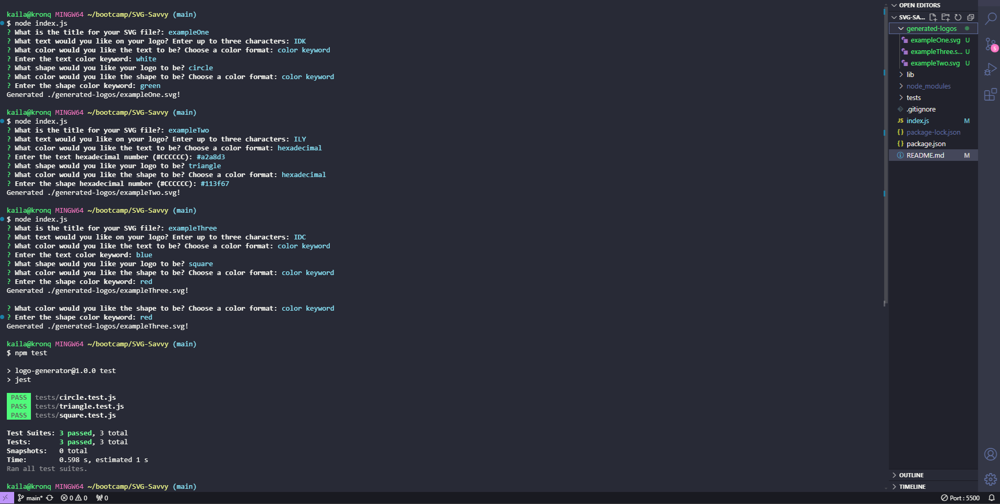

# SVG Savvy

SVG Savvy is a command-line application that allows users to create custom SVG logos by providing input for file name, text, text color, shape, and shape color. The application generates an SVG file with the specified name based on the user's input and displays the generated logo in a browser.

- Accepts user input for file name, text, text color, shape, and shape color.

- Supports color keywords or hexadecimal numbers for colors.

- Provides a list of shapes to choose from: circle, triangle, and square.

- Generates an SVG file with the specified name.

- Outputs the message "Generated .svg!" upon successful file creation.

## Installation

To install SVG Savvy:

- Clone the repository: https://github.com/girlnotfound/SVG-Savvy

- Navigate to the project directory

- Open the terminal and run the command: npm install

## Usage

To use SVG Savvy use the terminal to run the command: node index.js.

- You will be prompted to enter the name of the SVG file to be created. The file will be saved with the provided name and a .svg extension.

- You will be prompted to enter text for the logo - you can enter up to three characters.

- You will be prompted to enter the color for the text - you can enter a color keyword or a hexadecimal number.

- You will be prompted to choose a shape for the logo - available shapes are circle, triangle, and square.

- You will be prompted to enter the color for the shape - you can enter a color keyword or a hexadecimal number.

After entering all the prompts, an SVG file with the specified name will be created and the command line will output "Generated .svg file!" The logo will be displayed as a 300x200 pixel image.

[Link to Walk Through Video](https://app.screencastify.com/v3/watch/icyfAt44lbYYSCy6Cz1D)

## Credits

This project was made possible with the help of:

[Adam Rosenberg](https://github.com/AcoderRose)

[Ryan Petersen](https://github.com/RyanPetersen-89)

[Jordan Gonzales](https://github.com/JordanGWiz)

## Tests

To run the tests for SVG Savvy run the following command in the command line: npm test
